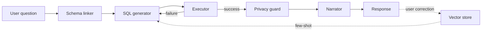
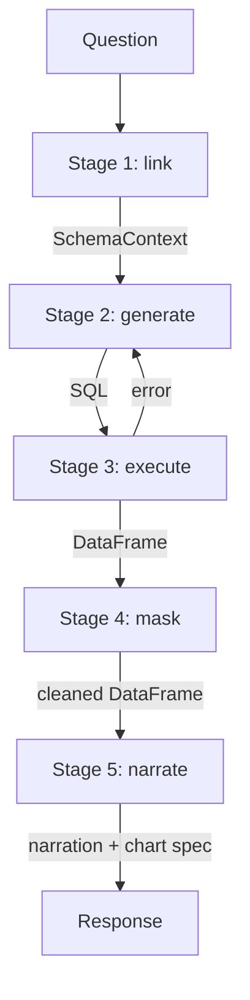

# Architecture

A deeper look at how Talk to Data is built. The [README](README.md) describes what the system does; this document explains how, and why each layer was designed the way it was.

This is written for engineers — interviewers walking through the project, contributors understanding the codebase, or future-me returning to this code in six months. It assumes you've read the README and want concrete detail.

## Table of contents

- [System overview](#system-overview)
- [Ingestion phase](#ingestion-phase)
- [Query phase](#query-phase)
- [Stage 1: Schema linking (Graph-RAG)](#stage-1-schema-linking-graph-rag)
- [Stage 2: SQL generation](#stage-2-sql-generation)
- [Stage 3: Execution and self-correction](#stage-3-execution-and-self-correction)
- [Stage 4: Privacy guard](#stage-4-privacy-guard)
- [Stage 5: Explanation and narration](#stage-5-explanation-and-narration)
- [Frontend architecture](#frontend-architecture)
- [REST contract](#rest-contract)
- [Streaming contract](#streaming-contract)
- [State management](#state-management)
- [Error handling philosophy](#error-handling-philosophy)
- [Why these choices](#why-these-choices)

## System overview

Talk to Data is a five-stage pipeline wrapped in a Flask REST API, consumed by a React conversational interface. The backend is stateful within a single process — pipeline components are initialised once and held as module-level state. The frontend is stateless beyond local Zustand stores, talking to the backend over HTTP.

The five stages — schema linking, SQL generation, execution, privacy, narration — run sequentially on every query. There are two feedback loops: the self-correction loop (stage 3 → stage 2) when execution fails, and the fix loop (stage 5 → vector store → stage 1) when the user corrects a query. Both loops feed back into the retrieval substrate so the system improves with use.



The dotted arrow is the system's learning mechanism. Successful queries are stored as Q-SQL pairs; user corrections overwrite previous pairs. On the next similar question, the linker retrieves the corrected example as a few-shot demonstration, propagating the lesson into all future generations.

## Ingestion phase

Ingestion happens once when `POST /api/init` is called. It does six things in sequence:

**A. Load the schema.** `SchemaLoader` reads two JSONL files: `banking_tables_typed.jsonl` (25 table definitions with columns, types, and foreign keys) and `banking_relationships_v2.jsonl` (25 named semantic relationships). The output is a normalised in-memory representation that every downstream component reads from.

The choice of JSONL over a single nested JSON file is deliberate. JSONL is append-only friendly, line-diffable in git, and lets the schema be edited incrementally. A 25-table schema is small enough that the entire file fits in memory; large enough that diffability matters when iterating.

**B. Build the knowledge graph.** `SchemaGraphBuilder` connects to a hosted graph database and populates 25 `Table` nodes connected by 25 directed `JOINS_TO` edges. Every edge stores its exact SQL join condition (`Customer.customer_id = Account.customer_id`) as a property, so the linker can reconstruct join paths without re-deriving them.

The graph is the structural backbone of schema linking. Vector retrieval gives the linker semantically relevant tables; the graph tells the linker which tables are *reachable* from those seeds and which join conditions to apply. A 1-hop expansion from any seed table catches every direct foreign-key relationship; a 2-hop expansion catches the bridge tables that don't appear in the question but are required for the SQL.

**C. Embed the schema into the vector store.** `SchemaEmbedder` runs sentence-transformers locally (no embedding API required) and populates three persistent collections:

- **DDL collection** — one CREATE TABLE statement per table, embedded for table-level retrieval
- **Documentation collection** — relationship descriptions, plus user-confirmed metric definitions, embedded for semantic guidance
- **Q-SQL collection** — question-SQL pairs that serve as few-shot examples; starts with 10 hand-verified seeds and grows as users ask questions

Three separate collections rather than one is a deliberate choice. The retrieval needs at each stage are different — the linker wants tables, the generator wants examples, both want documentation — and separate collections let each query target the right corpus without polluting the result set.

**D. Seed Q-SQL pairs.** Ten canonical question-SQL pairs are loaded from `SEED_QA_PAIRS` in `sql_gen.py`. These are the bootstrap few-shot examples — verified against the actual schema and the synthetic data, covering aggregation, filtering, joins, time-series, and top-N shapes. The seed pairs are the single source of truth: they're stored in the generator module (where SQL syntax expectations live) and loaded into the vector store at init time.

**E. Spin up the analytical engine and seed synthetic data.** A fresh in-memory analytical engine is created, and `BankingDataSeeder` populates each of the 25 tables with 50–100 rows of synthetic but referentially consistent data. Customers, accounts, balances, transactions — all generated with foreign keys that resolve correctly. This gives the executor real data to query during the demo without any external database connection.

In production this stage would route to a managed warehouse (Snowflake, BigQuery, Redshift) instead. The pipeline contract — `executor.execute_direct(sql) -> (df, error)` — doesn't change. Only the executor implementation does.

**F. Initialise the remaining components.** `SchemaLinker`, `MetricDictionary`, `SQLGenerator`, `SQLExecutor`, `ResultExplainer` are instantiated. If `metrics.yaml` exists from a previous session, confirmed metrics are loaded and re-embedded into the documentation collection. (The vector store's documentation collection is cleared on every reload, so this re-embedding step is what keeps confirmed metrics surviving across restarts.)

After init, `_state["initialised"]` flips to `True` and the system is ready to accept queries. The whole boot takes 5–10 seconds, dominated by the local sentence-transformer model loading on first run.

## Query phase

A single `POST /api/query` invocation runs all five stages in sequence. The streaming variant `POST /api/query/stream` runs the same code but yields Server-Sent Events between stages so the frontend can show live progress.

The orchestration logic lives in `app.py` — not in a separate orchestrator class. This is deliberate. Each stage component has a clean, narrow interface (`linker.link(question)`, `sql_gen.generate(context)`, `executor.execute_direct(sql)`), and the orchestrator is the thin glue that wires them together. Putting the wiring in `app.py` keeps the pipeline visible end-to-end at a single read; abstracting it behind an `Orchestrator` class would hide the actual flow behind class machinery.



The remainder of this document walks each stage in detail.

## Stage 1: Schema linking (Graph-RAG)

The linker's job is to convert a natural-language question into a structured `SchemaContext` object containing everything the SQL generator needs: relevant table DDLs, join conditions, business metric definitions, and a few-shot examples retrieved from past queries.

### The Graph-RAG mechanism

Pure vector search would surface the *semantically* relevant tables — the ones whose names or column descriptions match the question. It misses the *structurally* required tables that don't appear in the question but sit between the relevant tables as join bridges.

Worked example: *"Find all trade requests placed by high-risk customers."* Vector search returns `Customer` (matches "customers") and `TradeRequest` (matches "trade requests"). Missing: `Account`. The customer doesn't make trades directly — they hold accounts, and accounts make trades. Without `Account` in the context, the LLM either invents a non-existent `Customer.trade_request_id` foreign key or generates an incorrect cartesian join.

The linker fixes this by combining two retrievals:

1. **Vector search** over the DDL collection returns the top-K tables by semantic similarity to the question.
2. **Graph traversal** over the schema graph expands those K seeds by 1 hop, adding every directly-connected table along with the SQL join condition stored on each edge.

The final `SchemaContext` contains the union: seed tables plus their immediate neighbours, deduplicated. For the trade query above, the seeds are `Customer` and `TradeRequest`, and the 1-hop expansion catches `Account` because both seeds connect to it.

### The SchemaContext shape

```python
@dataclass
class SchemaContext:
    question: str
    relevant_ddls: list[str]          # CREATE TABLE statements
    relevant_docs: list[str]          # relationship descriptions + metric definitions
    relevant_qa_pairs: list[dict]     # few-shot examples
    join_paths: list[str]             # exact join conditions from graph edges
```

Every stage downstream consumes this object. Nothing inspects raw vector hits or raw graph nodes — the linker is the only component that talks to the retrieval substrate.

### Metric injection

Confirmed business metrics are injected into `relevant_docs` *before* the vector retrieval results, so they're guaranteed to reach the LLM even before the documentation collection has been queried for the current question. This solves a bootstrapping problem: on the very first query after init, the doc collection might not return metric definitions in its top-K, even though they're sitting there. Direct injection makes the guarantee explicit.

### Trade-offs

The graph traversal adds latency (~100–200ms per query). For a system where correctness is the headline feature, this is an acceptable cost. The vector search component is fast — sub-50ms locally — so the linker's total latency budget is well under half a second.

A pure-vector approach would be cheaper and simpler. It would also produce wrong answers on multi-hop questions, which are the questions that matter most.

## Stage 2: SQL generation

The generator constructs a six-layer prompt from the SchemaContext and calls the LLM to produce SQL. The prompt is constructed deterministically — same context produces the same prompt — and the LLM is called with `temperature=0.0` for the initial generation to maximise reproducibility.

### Prompt construction

Six layers, in this order:

1. **System role** — a short statement establishing the LLM as a SQL analyst writing queries against a specific dialect, with rules about column naming, JOIN syntax, and case sensitivity.
2. **Schema context** — every CREATE TABLE statement from `relevant_ddls`, in declaration order. The LLM reads exact column names rather than guessing them.
3. **Relationships and metrics** — concatenated `relevant_docs`, with the user-confirmed metric definitions appearing first. Metric definitions are formatted as `metric_name: SQL formula — description`.
4. **Few-shot examples** — every entry in `relevant_qa_pairs`, formatted as `Question: ... \n SQL: ...`. These act as in-context demonstrations of the expected output shape.
5. **Join paths** — the explicit join conditions retrieved from the graph, one per line. The LLM doesn't have to derive `Customer.customer_id = Account.customer_id` from the schema; it's handed the exact predicate.
6. **The user question** — the actual natural-language question, terminated with a directive to return SQL only (no prose, no markdown fences).

The output is parsed: any wrapping ```` ```sql ```` fences are stripped, leading/trailing whitespace removed, and the result returned as a plain SQL string.

### Self-correction prompt

When execution fails, the generator is called again with `regenerate_with_feedback(context, previous_sql, error_message)`. This builds a different prompt:

- Same six layers as above.
- Plus an additional **"Previous attempt"** block showing the failed SQL.
- Plus an **"Error"** block with the typed error classification and the raw error message.
- Plus a closing directive: *"Generate a corrected SQL query that addresses this specific error."*

The retry uses `temperature=0.1` — slightly more exploratory than the initial generation, deliberately, to escape the failure mode that produced the original error.

### Why six layers, in this order

The order matters. The LLM reads top-to-bottom, and instructions placed earlier in the prompt have stronger conditioning effect on the output. System role first establishes identity; schema next gives the LLM the vocabulary; relationships and metrics impose the business definitions; few-shot examples show the output shape; join paths give explicit help on the hardest sub-task (which the LLM might otherwise get wrong); the question goes last because by that point the LLM has all the context it needs to answer.

I tried a flatter prompt earlier — schema and question only — and the accuracy was substantially worse on multi-hop questions. The structured layering is what makes the generator reliable enough to ship.

---

## Stage 3: Execution and self-correction

The executor runs SQL against the analytical engine and returns either a DataFrame or a typed error. The orchestrator (in `app.py`) wraps this in a retry loop that runs up to three times.

### The execute_direct contract

```python
def execute_direct(sql: str) -> tuple[pd.DataFrame | None, Exception | None]:
    """Run SQL. Return (DataFrame, None) on success, (None, error) on failure."""
```

Two-tuple return rather than raising on failure is deliberate. The orchestrator wants to inspect failures structurally — classify them, route them back to the generator, log them — not catch a raised exception. Returning a None-or-value pair makes the failure path a normal control-flow branch.

### Error classification

Raw exceptions from the analytical engine are typed strings — useful for humans, less useful for prompting. The executor's `classify(error)` method maps these to a small enum:

```python
class ErrorType(Enum):
    COLUMN_NOT_FOUND = "COLUMN_NOT_FOUND"
    TABLE_NOT_FOUND = "TABLE_NOT_FOUND"
    SYNTAX_ERROR = "SYNTAX_ERROR"
    TYPE_MISMATCH = "TYPE_MISMATCH"
    AMBIGUOUS_REFERENCE = "AMBIGUOUS_REFERENCE"
    UNKNOWN = "UNKNOWN"
```

Classification is regex-based on the error message. The classified type is what gets sent back to the generator on retry — the LLM responds better to *"COLUMN_NOT_FOUND: column 'first_name' does not exist on table Customer"* than to a 200-character analytical-engine stack trace.

### The retry loop

for attempt in 1..MAX_RETRIES:
df, error = executor.execute_direct(current_sql)
if df is not None:
break
error_type = executor.classify(error)
correction_history.append({attempt, sql, error_type, error_message})
if attempt < MAX_RETRIES:
sql_result = sql_gen.regenerate_with_feedback(context, current_sql, error)
current_sql = sql_result.sql


Three attempts is the cap. Empirically, if the generator can't produce working SQL in three rounds with structured feedback, it's a context-quality problem (wrong tables in scope, missing metric definition) rather than a generator-quality problem, and more retries won't help. The user is better served by a clean failure message than by waiting for a fourth attempt.

Every attempt — successful or failed — is preserved in `correction_history` and surfaced in the UI as **Earlier attempts**. This is non-negotiable: silent retry is worse than visible failure, because silent retry teaches the user to trust answers that occasionally have hidden recovery paths.

### Zero rows is not failure

A query that returns zero rows is a successful execution — the data simply doesn't match the predicate. The executor returns the empty DataFrame, and the narrator handles the explanation ("No customers matched these criteria"). Treating zero rows as failure would trigger spurious retries that can't fix anything.

## Stage 4: Privacy guard

The privacy guard scans the result DataFrame for columns whose names match PII patterns and masks the values before the response leaves the pipeline. The scan happens at the response boundary — after execution, before narration — because:

- Masking before execution would require parsing and rewriting the SQL, which is fragile.
- Masking after narration would require redacting the LLM's prose, which is fragile.
- Masking the DataFrame between execution and narration is a clean, local, declarative operation.

### Pattern table

PII_PATTERNS = {
"name":           r"^name$|first_name|last_name|full_name|customer_name",
"email":          r"email|e_mail|email_address",
"phone":          r"phone|mobile|telephone",
"ssn":            r"ssn|social_security|national_id",
"dob":            r"dob|date_of_birth|birth_date",
"account_number": r"account_number|account_id",
"card_number":    r"card_number|credit_card|cc_number",
"address":        r"address|street|postcode|zip_code",
}

Every column name is normalised (lowercased, stripped) and tested against each pattern. Matches replace the column values with a fixed mask token (`"***"`) and the column reference is added to `masked_columns: list[{column, pattern}]` for surfacing in the UI's Privacy panel.

### What this catches and what it doesn't

This catches **standard PII column names**. It doesn't catch:

- Organisation-specific identifiers that don't match the standard patterns (a column called `legacy_id_v2` containing tax IDs would slip through).
- PII embedded inside non-PII columns (a `notes` field containing "John Smith called yesterday").
- PII inferred from combinations (postcode + DOB might re-identify someone even if both columns pass alone).

The pattern-based approach is a deliberate floor, not a ceiling. The future-work item "Replace pattern-based PII detection with a fine-tuned NER model" is the next step. For a portfolio demo, regex is correct: it's fast, deterministic, easily auditable, and catches the standard cases that matter most.

### Transparency over silence

When columns are masked, the user sees it. The Privacy panel in the UI lists every masked column with the pattern that triggered the match. This is the same principle as the correction history: silent protection is worse than visible protection, because users who don't know what was masked can't reason about whether the protection was correct.

## Stage 5: Explanation and narration

The narrator does three things in one LLM call: writes a 1–3 sentence plain-English summary of the result, selects an appropriate chart type, and identifies the x/y keys for the chart.

### The chart selection logic

The narrator is given the question, the column names, the row count, and a 5-row preview of the DataFrame. It returns a JSON object specifying:

```json
{
  "narration": "...",
  "chart_type": "bar" | "line" | "table" | "stat",
  "x_key": "column_name" | null,
  "y_key": "column_name" | null
}
```

Chart-type selection follows simple heuristics that the LLM is prompted to apply:

- **stat** — a single numeric value (1 row, 1 numeric column). "How many customers do we have?" → `stat` displaying `1247`.
- **line** — a numeric value over time. The narrator looks for a date or month column on the x-axis and a numeric column on the y. "How has revenue trended?" → line chart, `month` x, `revenue` y.
- **bar** — a numeric value across categories. Same shape as line but with a categorical x-axis. "Total balance per region" → bar chart, `region` x, `balance` y.
- **table** — when no other shape fits, or the question explicitly asks for a list. "Show me the top 10 customers" → table.

The frontend's `ChartCanvas` component dispatches on `chart_type` and renders accordingly. If the narrator returns an invalid chart_type, the frontend falls back to `table`.

### The metric attribution

The narrator's response also includes which confirmed metric was used, surfaced in the UI as `Using: total_balance — Sum of all account balances`. The detection is keyword-based: the narrator checks whether any confirmed metric name (or its description keywords) appears in the question, and returns the match. This is a transparency hint, not a routing decision — the SQL was already generated in stage 2 using the metric definition; the attribution just makes the use visible.

## Frontend architecture

The frontend is a single-page React 19 + TypeScript application built with Vite. The whole app is one conversational surface; there is no router, no separate pages. The UX model is "open the app, ask questions, see answers" — a chat-like surface that doesn't pretend to be email.

### Component layering

Three layers, each with a clear responsibility:

**Shell layer** — `AppShell` provides the page-level chrome: the warm indigo halo atmosphere, the frosted-glass header with wordmark and quiet icon affordances, the main content zone. Nothing the user explicitly interacts with lives here.

**Chat layer** — `ConversationView` orchestrates the conversational flow. It composes `UserTurn`s, `ResponseTurn`s, the in-flight `PipelineStatus`, the `Composer`, and the `EmptyState` (shown when no turns exist yet). The composer pins to the bottom of the viewport; turns scroll above it; the empty state centres in the available space.

**Result layer** — `ResponseTurn` composes the answer surface: `Narration` (streaming typewriter), `MetricAttribution` (the `Using: name — desc` line), `ChartCanvas` (visualization), and three audit panels (`SqlPanel`, `CorrectionPanel`, `PrivacyPanel`). Each audit panel is collapsed by default; expansion reveals the full detail.

There's also a `metrics` layer used only on first launch: `MetricScreen` orchestrates the proposal and confirmation ritual, with `MetricCard` displaying each proposed metric and `MetricEditor` providing inline editing.

### Design token system

All visual values flow from a token system defined in `frontend/src/index.css`. The brand colour, success colour, motion durations, easings, fonts, radii, and chart colours are CSS custom properties referenced everywhere downstream.

A small set of utility classes is layered on top:

- **`.card-surface`** — the premium card treatment: a subtle gradient background (lighter at top, darker at bottom), a 1px border at low opacity, an inset top-edge highlight that catches implied light from the page's warm halo, and a soft drop shadow for depth. Applied to `MetricCard`, `ChartCanvas`'s wrapper, and `PipelineStatus`'s container.
- **`.card-surface-subtle`** — a quieter variant for nested code or quote blocks. Used inside `MetricCard` for the SQL formula, inside `SqlPanel` for the expanded code block, inside `CorrectionPanel` for the failed SQL display, and on `SuggestedChips`.
- **`.audit-trigger`** — the click target for the SQL/Corrections/Privacy panel triggers. Slight typographic weight, hover background fill, properly rounded.

These three utilities are what give the product visual coherence. Every raised surface uses the same gradient-lift treatment; every nested code block uses the same subtle treatment; every audit toggle uses the same hover affordance.

### Animation philosophy

Motion is restrained. Transitions are 150–300ms; easings are productive (`cubic-bezier(0.4, 0, 0.2, 1)`) for most, expressive (`cubic-bezier(0.4, 0, 0.6, 1)`) for the few moments that warrant it. The narration uses a typewriter effect with variable cadence (faster on default characters, slower at commas, slowest at periods) implemented via a custom `useTypewriter` hook. Pipeline stage transitions use Framer Motion fade-and-slide. Nothing pulses, bounces, or wiggles — premium products earn trust by not asking for attention.

## REST contract

Every endpoint returns JSON with a top-level `ok: boolean`. On success, additional fields. On failure, `error: string`. No HTML 500 pages, no plain-text responses, no surprise content types.

The full endpoint list:

| Endpoint | Method | Purpose |
|---|---|---|
| `/api/health` | GET | Liveness check |
| `/api/init` | POST | Initialise pipeline; seed data |
| `/api/status` | GET | Pipeline readiness; component summary |
| `/api/metrics/propose` | POST | LLM proposes business metrics |
| `/api/metrics/confirm` | POST | Save user-confirmed metrics |
| `/api/metrics` | GET | List confirmed metrics |
| `/api/query` | POST | Synchronous query — full pipeline |
| `/api/query/stream` | POST | Streaming query — SSE events per stage |
| `/api/fix` | POST | Store a user-corrected Q-SQL pair |
| `/api/history` | GET, DELETE | Query history (last 20) |
| `/api/reset` | POST | Reset pipeline state |

The `/api/query` response shape:

```json
{
  "ok": true,
  "success": true,
  "answer": {
    "narration": "...",
    "chart_type": "bar",
    "chart_data": [...],
    "columns": ["region", "balance"],
    "x_key": "region",
    "y_key": "balance",
    "row_count": 5
  },
  "metric_used": { "name": "total_balance", "description": "...", "sql_formula": "..." },
  "sql": "SELECT ...",
  "was_corrected": false,
  "corrections": [],
  "privacy": { "masked_columns": [] },
  "timestamp": "2026-05-10T..."
}
```

This is the contract the frontend depends on. Adding fields is safe; renaming or removing fields is not. Every field the frontend uses has a corresponding TypeScript type in `frontend/src/lib/types.ts`, kept in sync with the backend manually (a future improvement is to generate the types from a shared schema).

## Streaming contract

The streaming endpoint `/api/query/stream` runs the same five stages but emits Server-Sent Events between them. Event names and payloads:

event: stage_active
data: {"stage": "linking"}
event: stage_complete
data: {"stage": "linking", "tables": ["Customer", "Account", "TradeRequest"], "table_count": 3}
event: stage_active
data: {"stage": "generating"}
event: stage_complete
data: {"stage": "generating", "attempts": 1, "success": true}
event: stage_active
data: {"stage": "executing"}
event: stage_complete
data: {"stage": "executing", "row_count": 47, "was_corrected": false, "correction_count": 0}
event: stage_active
data: {"stage": "narrating"}
event: stage_complete
data: {"stage": "narrating", "metric_used": "total_balance", "chart_type": "bar"}
event: done
data: { ... full /api/query response payload ... }

The `done` event carries the same payload as the synchronous endpoint, so a streaming client can reuse the same response handlers as a non-streaming client. Errors emit `event: error` with `{ok: false, error: "..."}`.

The frontend currently uses `/api/query` (synchronous) with client-side stage timing approximations because the streaming path requires `EventSource` plumbing that wasn't yet wired at the time of the demo. End-to-end streaming is a planned upgrade — see the README's future work section.

## State management

The frontend uses Zustand for cross-component state. Three stores:

**`statusStore`** — pipeline readiness. Holds the result of `/api/init` and `/api/status`: whether the backend is initialised, how many metrics are confirmed, the schema/graph counts. Drives the boot screen, the metric setup screen, and the main app gate.

**`metricsStore`** — confirmed metrics. Holds the list returned by `/api/metrics`, plus draft state during the proposal/confirmation flow. Local-only writes during editing; backend round-trip on confirm.

**`conversationStore`** — turn history. Holds the array of `ConversationTurn`s rendered in `ConversationView`, the current in-flight pipeline status, and the submit handler. This is the store with the most write traffic — every question append, every response, every status update goes through it.

I considered React Context and skipped it. Zustand's selector-subscription model is more efficient for the access patterns this app has (most components read one slice, very few read everything), and the API surface is smaller.

I considered React Query and skipped it. The API call patterns here are simple — initialise once, query on submit, occasional metric round-trips — and don't need cache invalidation, request deduplication, or background refetching. A plain `fetch` wrapper in `useApi` is sufficient.

## Error handling philosophy

Three classes of errors, three different handling paths:

**User errors** — empty question, invalid metric edit, malformed input. These are caught at the form/component layer with inline validation. Never reach the backend.

**Pipeline errors** — SQL fails after three retries, executor returns no DataFrame, narrator returns malformed JSON. These are returned as structured `{ok: true, success: false, error: "..."}` responses. The frontend renders them as a *response turn with an error narration* — the system explains what went wrong, suggests rephrasing, and shows the failed SQL. The conversation continues; the user can ask a different question.

**System errors** — backend not initialised, network failure, unexpected exception. These return `{ok: false, error: "..."}` with HTTP 4xx/5xx. The frontend renders these as a banner above the conversation, distinct from response turns.

The principle is that errors that the user can do something about (rephrase, retry, edit metrics) belong inline in the conversation; errors that require operator intervention (server down, init failed) belong as out-of-band banners.

## Why these choices

A condensed restatement of the design decisions, with the trade-offs explicit.

**Graph-RAG over flat RAG.** Cost: one external dependency (graph database), ~150ms added latency per query. Benefit: correctness on multi-hop questions. For an analytics tool where wrong answers erode trust, the trade is right.

**Semantic layer with human confirmation.** Cost: one-time onboarding step; users have to confirm metrics before first query. Benefit: every query that follows is interpretable and auditable; the same question produces the same answer across days. For a tool where consistency matters, friction at setup is the right place to put it.

**Self-correction loop with full audit.** Cost: failed-then-corrected queries take 2–3× longer than first-attempt successes. Benefit: visible recovery beats silent failure; users understand why the answer is what it is. Slower with explanation > faster with magic.

**In-process analytical engine.** Cost: single-machine; doesn't scale to multi-user production. Benefit: no network latency for execution, no external infrastructure beyond the LLM and graph database, runs on a laptop. For a portfolio demo, the trade is right; for production, the executor swaps out without changing pipeline contracts.

**Vector store for Q-SQL pairs over static few-shot.** Cost: bootstrap depends on hand-curated seed pairs until the store accumulates real corrections. Benefit: the system learns from use without retraining; every user correction is a signal that propagates to all future queries. The 10 seed pairs are sufficient bootstrap; the marginal cost of curating them is negligible against the structural benefit.

**Module-level state in Flask, single-threaded.** Cost: no concurrency, no multi-user isolation. Benefit: pipeline components can hold expensive resources (DB connections, embedded models) without re-init per request, and there are no race conditions to reason about. For a single-user demo, single-threaded is the right configuration; for production, the state would move into a per-session store.

**Three card-surface utilities, used everywhere.** Cost: every card surface in the system shares the same visual treatment, which means a poor utility design contaminates the whole product. Benefit: visual coherence emerges automatically; new components inherit the design language by applying one class. The utilities were iterated against rendered output until they felt right; locking them in as a system primitive made the rest of the design work converge faster.

**Restraint over decoration.** No animated atmospheres, no pulsing icons, no decorative gradients beyond the page-level halo. Cost: the product is quieter than competitors that lean on motion to feel alive. Benefit: the user's attention goes to the data and the reasoning, which is where attention belongs. Linear, Vercel, Apple — all the references — earn premium feel by what they leave out.

## What's next

Five concrete extensions, in priority order:

1. Replace pattern-based PII detection with a fine-tuned NER model.
2. Add per-user row-level security via session tokens flowing through the SQL generator.
3. Wire the SSE endpoint end-to-end so pipeline stages reflect real backend progress.
4. Mine the fix-loop's accumulated corrections for new metric proposal candidates.
5. Extend the schema linker to support cross-schema federated queries.

Each of these is its own small project. Each respects the pipeline contracts so it can land without disturbing the rest of the system.


If you've read this far, you understand how Talk to Data works. The codebase is structured to match this document — every section here corresponds to a file or folder you can open and read. Start with `backend/app.py` to see the orchestration; from there, every component is one import away.

Built with care.