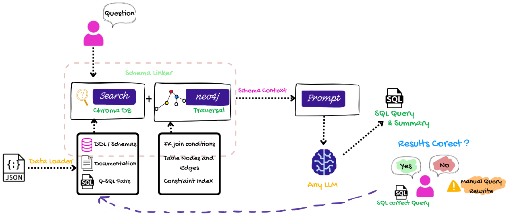

# Talk to Data
 
**Ask a question in plain English. Get back the SQL, the result, and an explanation.**
 
[](https://python.org)
[](https://groq.com)
[](https://trychroma.com)
[](https://neo4j.com/cloud/aura)
[](https://duckdb.org)
[](LICENSE)
 
Built for **NatWest Code for Purpose 2026 — Theme 1: Seamless Self-Service Intelligence.**
---
 


## The Problem
 
Banking analysts wait days for data engineers to run reports. The data exists. The question is clear. The bottleneck is the SQL.
 
Talk to Data removes that bottleneck. It lets any analyst ask a question in plain English and instantly receive the correct SQL query, the result, and a plain English explanation of what was found.
 
The intended users are **banking analysts and business stakeholders** who understand their domain deeply but do not write SQL.
 
## How It Works
 
Two phases. One question.
 
**1. Train (once at startup)**
 
```python
# Load the banking schema — 25 tables, 25 FK-validated relationships
loader = SchemaLoader().load()
 
# Embed into ChromaDB: DDL collection, docs collection, Q-SQL pairs collection
embedder.load_from_schema(loader)
embedder.seed_qa_pairs(SEED_QA_PAIRS)
 
# Build the Neo4j schema graph: 25 nodes, 25 edges, join conditions on every edge
graph.build_from_loader(loader)
```
**2. Ask**
 
```python
ctx    = linker.link("Show me all trades for high-risk customers")
result = generator.generate(ctx)
print(result.sql)
```
 
```sql
SELECT t.trade_id, t.price, t.quantity, c.customer_id
FROM Trade t
JOIN Order o ON t.order_id = o.order_id
JOIN Account a ON o.account_id = a.account_id
JOIN Customer c ON a.customer_id = c.customer_id
WHERE c.risk_rating = 'HIGH';

```
The join path `Customer → Account → Order → Trade` was discovered by Neo4j graph traversal. Neither `Account` nor `Order` appeared in the question. The system found them because it knows the schema graph.
 
## Why Graph-RAG, Not Just RAG
 
Standard text-to-SQL hands the LLM the full schema and hopes it writes the right JOINs. That works for single-table queries. It fails on cross-service joins.
 
Our banking schema spans five microservices. Most questions skip over the intermediate tables entirely.
 
| Approach | "Trades for high-risk customers" |
|---|---|
| Pure RAG (vector only) | Finds Customer, Trade. Misses Account and Order. LLM hallucinates JOIN or fails. |
| Graph-RAG (this system) | Finds Customer, Trade. Neo4j traverses to Account and Order. LLM receives exact JOIN conditions. |
 
ChromaDB answers: *which tables are relevant?*
Neo4j answers: *how do those tables connect?*
The LLM writes SQL using both.
 
## The Data
 
Most teams working on text-to-SQL use CSV files or public datasets. We built on the format real organisations actually use: a **microservice schema registry**.
 
Twenty-five tables across five banking services (`CustSrv`, `CoreSrv`, `WealthSrv`, `TradeSrv`, `AuthSrv`), stored as JSONL with explicit foreign keys, validated to ensure every relationship has a backing FK and a derivable SQL join condition. The graph builder derives those join conditions automatically and stores them on the Neo4j edges so the LLM never has to guess.

## Features
 
**Implemented and working:**
 
- Schema ingestion from JSONL — 25 tables and 25 FK-backed relationships loaded into ChromaDB and Neo4j on startup
- Three ChromaDB collections following Vanna's training data architecture — DDL, documentation, Q-SQL pairs
- Graph-RAG schema linking — ChromaDB semantic search combined with Neo4j `shortestPath` traversal for multi-hop cross-service JOIN discovery
- SQL generation via Groq `llama-3.3-70b-versatile` — 6-layer structured prompt (schema, joins, docs, examples, question), temperature 0.0
- Self-correction loop — failed SQL execution appends the error to the prompt and regenerates, up to 3 attempts
- 10 seeded Q-SQL pairs loaded into ChromaDB at startup for few-shot examples
- User-confirmed metric definitions — `add_documentation()` interface for business metric confirmation before first query
- FK-derived join conditions stored on Neo4j edges and passed verbatim to the LLM

**Partially implemented or in progress:**
 
- DuckDB SQL execution — the executor is designed; synthetic data seeding is not yet complete
- PII column masking — scaffolded in `src/privacy/`; masking logic not yet written
- Correction storage loop — corrected Q-SQL pairs are not yet written back to ChromaDB after a user fix

## Install and Run
 
**Prerequisites:** Python 3.11+, a free [Groq API key](https://console.groq.com), a free [Neo4j AuraDB instance](https://console.neo4j.io).
 
```bash
git clone <https://github.com/somya-ban/talk-to-data.git>
cd talk-to-data
 
python -m venv envdata
envdata\Scripts\activate        # Windows
# source envdata/bin/activate   # macOS/Linux
 
pip install -r requirements.txt
```
 
Copy `.env.example` to `.env` and fill in your credentials:
 
```bash
cp .env.example .env
```
 
```env
GROQ_API_KEY=
 
NEO4J_URI=neo4j+s://xxxx.databases.neo4j.io
NEO4J_USERNAME=your_instance_id
NEO4J_PASSWORD=your_password
NEO4J_DATABASE=your_instance_id
```
 
Verify each component before running:
 
```bash
python test_neo4j.py           # Neo4j connection
python test_schema_linker.py   # Graph-RAG retrieval
python test_sql_gen.py         # End-to-end SQL generation
```


## Usage Example
 
The three test scripts demonstrate the full pipeline. Here are example questions and what the system returns.
 
**Question:** *What is the total balance across all accounts?*
 
```sql
SELECT SUM(ab.balance) AS total_balance FROM AccountBalance ab;
```
Each result also returns a one-sentence plain English explanation of what the query does.

## Architecture
 
The system is structured in four layers.
 
**Ingestion** (`src/ingestion/`) reads the JSONL schema files. `loader.py` converts every table to a `CREATE TABLE` DDL statement and every relationship to a plain-English documentation string with an explicit JOIN clause. These feed into ChromaDB.
 
**Retrieval** (`src/retrieval/`) has three files. `embedder.py` manages three ChromaDB collections. `graph_builder.py` populates Neo4j with Table nodes and directed relationship edges, storing the SQL join condition on every edge. `schema_linker.py` combines both: vector similarity search finds relevant tables, then Neo4j 1-hop traversal expands the set to include intermediate join tables that were not mentioned in the question.
 
**Generation** (`src/generation/`) constructs a structured prompt from the `SchemaContext` object and calls Groq. The prompt layers are: system instructions, DDL statements, join conditions from Neo4j, business definitions, few-shot examples from ChromaDB, and the user question.
 
**Execution** (`src/validation/`) runs generated SQL against DuckDB. If execution fails, the error message is appended to the prompt and the LLM regenerates.
 
> We use Neo4j's `shortestPath` Cypher traversal to find multi-hop join paths between any two tables in the banking schema graph. This addresses the core failure mode of pure vector-based text-to-SQL: intermediate join tables that are structurally necessary but semantically invisible in the user's question.

## Future Improvements

- Wire the correction loop so validated SQL improves the system over time
- PII column detection and result masking
- Metric confirmation UI — user defines business metrics before first query

## Research Basis
 
The architecture synthesises lessons from:
 
- **Vanna AI** — three training data types (DDL, documentation, Q-SQL pairs) and the ChromaDB vector store pattern
- **LinkedIn SQL Bot** — table pruning before LLM context construction (schema linking)
- **DIN-SQL** — decomposed SQL generation for multi-table queries
- **CHESS** — evidence-based prompting with explicit join conditions

## License

MIT License — see [LICENSE](LICENSE) for details.
