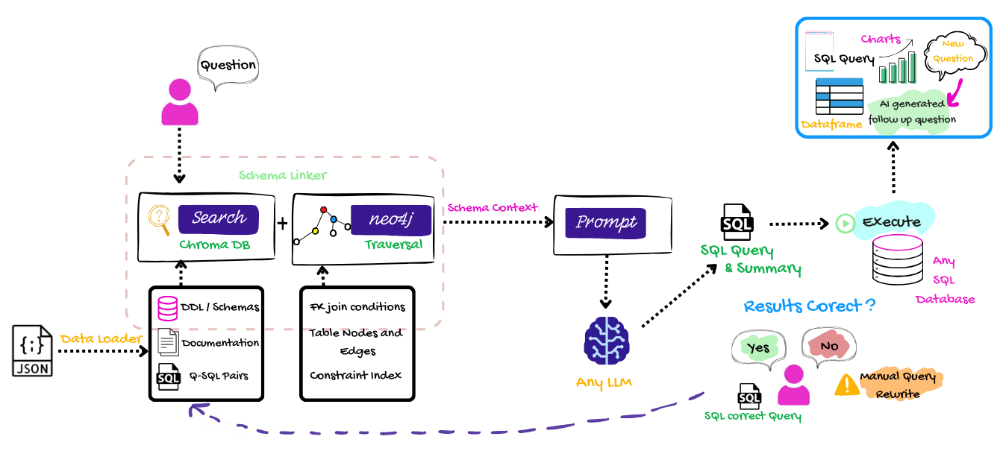
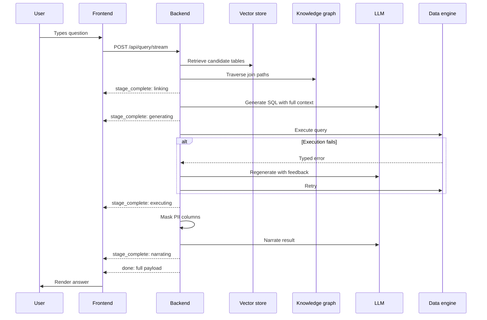

<div align="center">

# Talk to Data

**Conversational analytics for enterprise relational data.**
Graph-RAG retrieval, semantic-layer governance, privacy guards, and self-correcting SQL generation — in a single auditable pipeline.

[](LICENSE)
[](https://python.org)
[](https://react.dev)
[](https://typescriptlang.org)
[](https://vitejs.dev)
[](https://tailwindcss.com)
[](https://radix-ui.com)
[](https://framer.com/motion)
[](https://recharts.org)
[](https://zustand-demo.pmnd.rs)



[**▶ Watch the demo**](https://www.loom.com/share/c79629b4d35c4a40a2518f310f1eb2a3)

</div>

## The problem

Business analysts wait days for data engineers to write reports they could describe in a sentence. The bottleneck isn't intent — analysts know what they want. The bottleneck is translating business questions into correct SQL across schemas with dozens of tables, ambiguous column names, and join paths that aren't obvious without tribal knowledge.

Three failure modes show up across every text-to-SQL product I have used:

1. The model invents column names that look plausible. The query runs, returns data, and the data is wrong.
2. The same business question returns different numbers on different days because the model decides what "active customer" means each time.
3. When a query fails, the model retries silently or gives up. The user never sees what went wrong, so they cannot intervene.

Talk to Data is built around the assumption that these are not LLM problems. They are interface problems. The fix is showing the work, grounding every answer in user-confirmed definitions, and treating execution feedback as a first-class signal rather than an exception to swallow.

## What this is

A natural-language interface to relational databases that prioritises auditability over fluency. You ask a question. The system tells you which tables it picked, which business metric it applied, what SQL it generated, what failed and how it recovered, what data was masked for privacy reasons, and finally answers in plain English with a chart.

Every step is shown. Every step is real. None of it is post-hoc explanation.

It is industry-agnostic. The reference deployment ships with a 25-table financial schema for demonstration, but the architecture treats the schema as input. Healthcare, retail, manufacturing, any domain with a relational model and an LLM API key.

## How it works

The pipeline runs in two phases. Ingestion happens once at startup; the query pipeline runs on every question. The frontend talks to the backend over Server-Sent Events for live pipeline visibility, and over standard JSON for everything else.


```mermaid
sequenceDiagram
    participant U as User
    participant F as Frontend
    participant B as Backend
    participant V as Vector store
    participant K as Knowledge graph
    participant L as LLM
    participant D as Data engine

    U->>F: Types question
    F->>B: POST /api/query/stream
    B->>V: Retrieve candidate tables
    B->>K: Traverse join paths
    B-->>F: stage_complete: linking
    B->>L: Generate SQL with full context
    B-->>F: stage_complete: generating
    B->>D: Execute query
    alt Execution fails
        D-->>B: Typed error
        B->>L: Regenerate with feedback
        B->>D: Retry
    end
    B-->>F: stage_complete: executing
    B->>B: Mask PII columns
    B->>L: Narrate result
    B-->>F: stage_complete: narrating
    B-->>F: done: full payload
    F->>U: Render answer
```

The structured response includes the narration, the chart specification, the SQL that ran, the metric used (if any), the list of masked columns, and the full correction history. Nothing is hidden behind the answer; everything is one click away.

## Quick start

You will need:

- 🐍 **Python 3.11 or higher**
- 📦 **Node.js 20 or higher** with `npm`
- 🔑 **An LLM API key** (configured in `backend/.env`)
- 🌐 **A managed graph database instance** (free tier is sufficient — connection details in `backend/.env`)

### Clone

```bash
git clone https://github.com/somya-ban/talk-to-data.git
cd talk-to-data
```

### Backend

In your first terminal:

```bash
cd backend
python -m venv envdata
.\envdata\Scripts\activate           # Windows
source envdata/bin/activate          # macOS / Linux
pip install -r requirements.txt
cp .env.example .env                 # then fill in the values
python app.py
```

The Flask API starts on `http://localhost:5000`. The startup banner lists every available endpoint.

### Frontend

In your second terminal:

```bash
cd frontend
npm install
cp .env.local.example .env.local     # default points at localhost:5000
npm run dev
```

The Vite dev server starts on `http://localhost:5173`. Open it in your browser.

##Project structure

<details>
<summary><b>📂 Click to expand</b></summary>

```text
talk-to-data/
├── backend/                          # Python pipeline + REST API
│   ├── data/                         # Schema definitions (JSONL, FK-validated)
│   ├── src/
│   │   ├── ingestion/                # Schema loading and synthetic data seeding
│   │   ├── retrieval/                # Vector embedding, graph builder, schema linker
│   │   ├── semantic/                 # Metric dictionary (proposes, confirms, persists)
│   │   ├── generation/               # SQL generator with few-shot grounding
│   │   ├── validation/               # Executor with self-correction loop
│   │   ├── privacy/                  # PII detection and masking
│   │   └── explanation/              # Narration and chart selection
│   ├── tests/                        # Backend test suite
│   ├── app.py                        # Flask app + REST contract
│   ├── requirements.txt
│   └── .env.example
├── frontend/                         # React conversational interface
│   ├── src/
│   │   ├── components/               # shell, chat, result, metrics, ui
│   │   ├── hooks/                    # useTypewriter, useApi, usePipelineStages
│   │   ├── store/                    # Zustand stores (conversation, metrics, status)
│   │   ├── lib/                      # API client, type definitions, transforms
│   │   ├── App.tsx
│   │   └── index.css                 # Design tokens + card-surface utilities
│   ├── package.json
│   └── .env.local.example
├── docs/                             # Architecture diagrams and design notes
├── LICENSE                           # Apache 2.0
└── README.md
```
</details>

## Design decisions

The choices behind this project are visible by design. Each one names the trade-off it accepts.

✅ **Graph-RAG, not flat vector retrieval.** Vector search finds semantically relevant tables. It misses structurally required intermediate joins. Graph traversal closes that gap — at the cost of one external dependency and ~150ms added latency. For correctness-critical analytics, the trade is right.

✅ **A semantic layer instead of LLM inference.** Letting the model guess what *revenue* means produces plausible-but-wrong answers that erode trust. The metric layer makes business definitions a first-class artifact: confirmed once, version-controlled, surfaced inline in every answer. Adds onboarding friction; removes interpretive ambiguity from every query that follows.

✅ **A self-correcting execution loop instead of failing on first error.** Most LLM-generated SQL failures (hallucinated columns, type mismatches, ambiguous references) are recoverable when the error is fed back as structured context. Three retries, every attempt preserved as audit. Slower with explanation beats faster with silent failure.

✅ **An in-process analytical engine instead of a server-based database.** Eliminates network latency, simplifies deployment, runs on a laptop. Single-machine by design — production deployment would route the executor to a managed warehouse without changing the pipeline contract.

✅ **A vector store of Q-SQL pairs instead of static few-shot prompts.** Examples in the prompt are frozen. A vector store learns: every successful query is added back, every user-corrected query overwrites the previous example. Bootstrap quality depends on hand-verified seed pairs until the store accumulates corrections — the mitigation is shipping with 10 canonical seeds covering aggregation, filtering, joins, time-series, and top-N shapes.

## Future work

A few concrete extensions, in priority order:

🛡️ Replace pattern-based PII detection with a fine-tuned NER model trained on enterprise PII patterns, including organisation-specific identifiers that the current regex layer misses.

🔐 Add per-user row-level security: a session token flowed through the SQL generator that automatically appends `WHERE user_id = ?` predicates based on the requesting user's permission groups. The Vanna 2.0 user-aware tools pattern, adapted to the Graph-RAG pipeline.

⚡ Wire the Server-Sent Events endpoint end-to-end so the pipeline status stages reflect real backend progress instead of client-side timing approximations.

🧠 Replace the hand-curated metric proposal flow with a continuous learning loop where every confirmed correction in the fix-loop is mined for new metric candidates.

🌐 Extend the schema linker to support cross-schema joins where federated query routing decides which warehouse to execute against.

<div align="center">

Built with ❤️ by **[the team](https://github.com/somya-ban)**.

</div>
